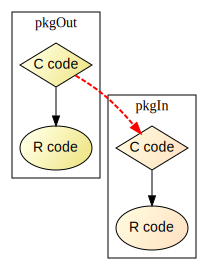

Linking to native routines in another package: a demo
===
Jitao David Zhang, 2020.01.04

**How to use C codes in another R package? A demo.**

## Background

The package `pkgIn` links to native routines `pkgOut_func` and `pkg_version` exported by `pkgOut`. Please check both packages out to see the details.

## Major notes

The examples were built by following the instructions given in the [*Writing R Extensions* manual](https://cran.r-project.org/doc/manuals/r-release/R-exts.html#Linking-to-native-routines-in-other-packages). 

A few details, however, may need highlighting, because I stumbled upon them on the first attempts. 

Keep in mind that we use `pkgOut` to refer to the package that exports a native routine and `pkgIn` to refer to the package that uses a foreign routine.

1. Use `R_RegisterCCallable` to register the function in the pkgOut package. They do not have to be registered routines called by .C/.Call/.Fortran/.External. Rather, they can be any C function. 
2. `import` or `importFrom` (or `@import` in roxygen2) must be called in the pkgIn package so that the exported function from the pkgOut package can be found.
3. Add `LinkingTo: pkgOut` in the `DESCRIPTION` file in the incoming package. This will allow linking native routines.
4. Use `(TYPE(\*)(PARAMETER TYPE)) R_GetCCallable("pkgOut", "pkgOut_func")` in `R_init_pkgIn` to retrieve the function in the pkgIn package.
5. *DO NOT* include the header file of outgoing package in the init file of incoming package. Otherwise, an error message complaining left-hand expression assignment will be raised.

## Minor notes

1. Only functions returning `SEXP` can be called by `.Call`, otherwise the memory will not be mapped and the R session will die ugly. This also apply to `void` functions.
2. Check `NAMESPACE` in case a `.Call` function cannot be found. Particularly when `package.skeleton` was used to generate the package structure and then *roxygen2* was used, in which case the NAMESPACE file is *not* overwritten by default.
3. Use `SET_STRING_ELT(SEXP object, 0, mkChar(char \*))` to convert C strings to R strings, and `CHAR(STRING_ELT(SEXP object, 0))` to do the reverse, namely to convert R strings to constant (`const`) C strings.

## Prior art and relevant resources

This is not the first attempt to create a minimalistic example of linking native
routines in R for teaching and demonstration purposes. For instance, a project
with similar purposes was created by David Vaughan and can be found here:
https://github.com/DavisVaughan/cexport. Canonical examples that can be found in
the *Writing R Extensions* and other online resources that demonstrate
between-package native-routine linking include packages `zoo` and `xts`, `xts`
and `RcppXts` (with a write-up from 2013 available
[here](https://learnpy.readthedocs.io/en/latest/)), `lme4` and `Matrix`, as well
as `expm` and `Matrix`.

This piece of work is different from real-life packages, because it uses
minimalistic examples to demonstrate the purpose and the basic techniques,
without involving non-essential commands relevant for native routine linking.
Compared with the `cexport` package created by David Vaughan, the demo packages
here are more recent (compatible with R-4.0), arguably more compact (because
both packages are stored in the same directory), and come with a visual element
that help readers appreciate the issue.

## Acknowledgement

I thank David Vaughan, Dirk Eddelbuettel, and Jan Gorecki for providing
resources, highlighting previous work and art, and offering alternative views to
improve this piece of work.

